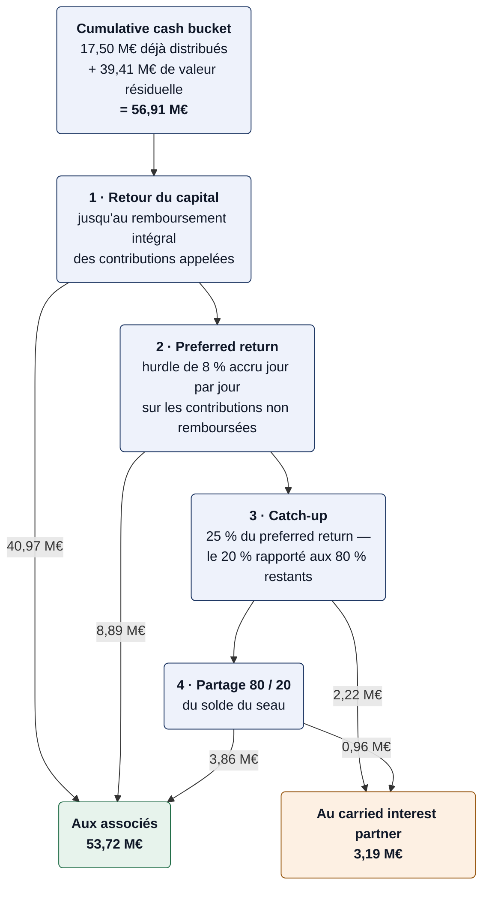
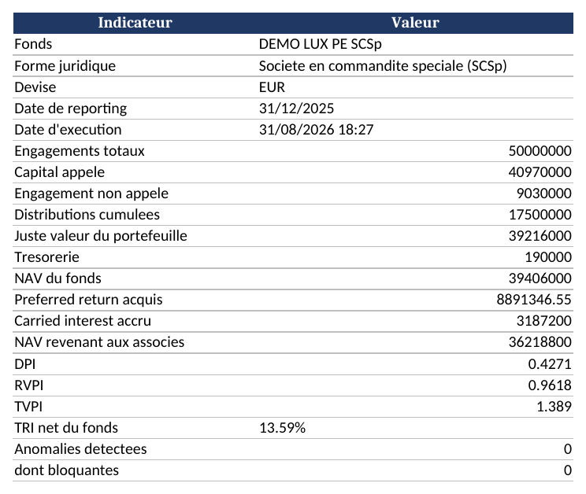
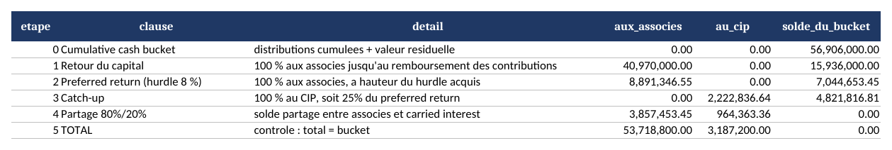
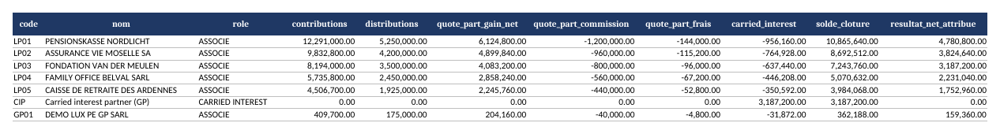
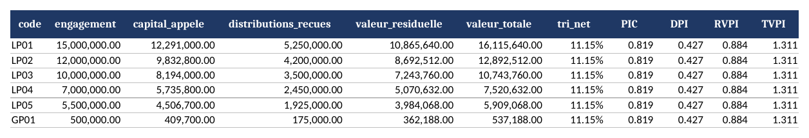
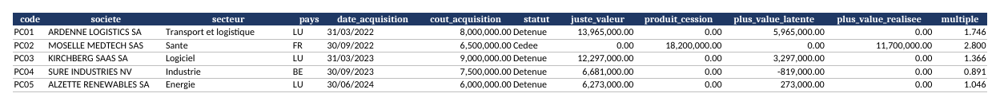
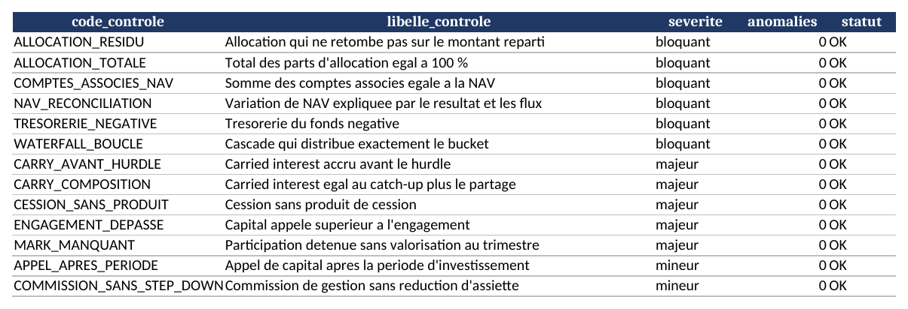
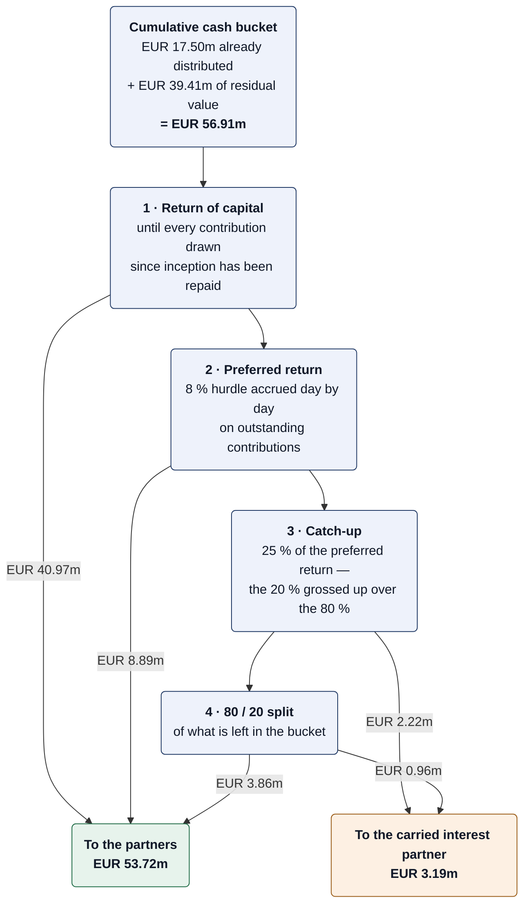

# scsp-capital-tracker

[](https://github.com/cyrilportfolio/scsp-capital-tracker/actions/workflows/ci.yml)

**Comptabilité investisseurs d'un fonds de private equity luxembourgeois (SCSp) : appels de capital, valeur nette d'inventaire, cascade de répartition whole-of-fund et états de compte par associé.**
*Investor accounting for a Luxembourg private equity fund (SCSp): capital calls, net asset value, whole-of-fund distribution waterfall and per-partner capital account statements.*

Python · pandas · openpyxl · pytest · Docker
[Français](#français) — [English](#english)

---

## Français

### Le problème

La SCSp est le véhicule dominant du private equity luxembourgeois. Derrière chaque fonds, un administrateur tient les comptes des investisseurs : il appelle le capital au prorata des engagements, valorise le portefeuille chaque trimestre, calcule la valeur nette d'inventaire, accroît le carried interest du gérant, et envoie à chaque *limited partner* un état de compte qui doit tomber juste au centime.

Ce dépôt fait ce travail de bout en bout, sur un fonds simulé, en une commande.

### Ce que fait le pipeline

1. **Appels de capital** — répartition au prorata des engagements, suivi de l'engagement non appelé, avis d'appel par associé au format ILPA.
2. **Valorisation et NAV** — juste valeur trimestrielle des participations, commission de gestion avec réduction d'assiette à la fin de la période d'investissement, NAV du fonds et par associé.
3. **Cascade whole-of-fund** — retour du capital, preferred return, catch-up, partage 80/20, et le carried interest accru qui en découle.
4. **États de compte** — le capital account statement de chaque associé, trimestre par trimestre, avec les multiples PIC, DPI, RVPI, TVPI et le taux de rendement interne net.
5. **Contrôles** — treize vérifications de cohérence avant qu'un chiffre ne sorte.

### La cascade, pas à pas

C'est le cœur du dépôt, et le seul endroit où une erreur coûterait cher au gérant comme à l'investisseur.

Le modèle retenu est le **whole-of-fund européen** : toutes les contributions reviennent d'abord, au niveau du fonds pris dans son ensemble, avant que le titulaire du carried interest ne touche quoi que ce soit. La mécanique suit le *cumulative cash bucket* — à une date donnée, le seau contient les distributions déjà versées plus la valeur résiduelle du fonds, et ce seau est déversé sur quatre marches.



Les deux marches du milieu sont celles qui décident de tout : le hurdle fixe le seuil au-delà duquel le gérant est intéressé, le catch-up lui fait rattraper d'un coup sa part de ce hurdle.

Voici le résultat au 31 décembre 2025 sur le jeu de données fourni :

```
CASCADE DE REPARTITION
  etape  clause                         aux_associes   au_cip        solde_du_bucket
  ----------------------------------------------------------------------------------
  0      Cumulative cash bucket         0.00           0.00          56,906,000.00
  1      Retour du capital              40,970,000.00  0.00          15,936,000.00
  2      Preferred return (hurdle 8 %)  8,891,346.55   0.00          7,044,653.45
  3      Catch-up                       0.00           2,222,836.64  4,821,816.81
  4      Partage 80%/20%                3,857,453.45   964,363.36    0.00
  5      TOTAL                          53,718,800.00  3,187,200.00  0.00
```

Trois points méritent d'être soulignés, parce que ce sont les trois endroits où l'on se trompe.

**Le catch-up fait partie du carried interest.** Pour un partage 80/20, il vaut 25 % du preferred return — c'est le 20 % rapporté aux 80 % restants. Ici 2 222 836 € de catch-up plus 964 363 € de partage font **3 187 200 € de carried interest**. L'oublier revient à sous-estimer la rémunération du gérant de plus des deux tiers.

**Le preferred return n'est pas 8 % du capital appelé.** Il est accru jour par jour sur les contributions non encore remboursées, et capitalisé à chaque anniversaire du premier appel. Certains contrats le définissent plutôt comme un TRI sur les flux de l'associé ; les deux méthodes donnent des résultats voisins, mais la première montre son calcul, et c'est elle qui est implémentée. Le détail jour par jour figure dans l'onglet « Preferred return » du classeur.

**Le carried interest est une réallocation, pas une charge.** Il ne modifie pas la NAV du fonds : il déplace des capitaux propres des associés vers le titulaire du carried interest. Le contrôle correspondant vérifie que la somme des comptes associés, celui du carried interest compris, égale exactement la NAV à chaque trimestre.

### Vérifié sur un cas publié

Un calcul de waterfall qui ne tombe juste que sur ses propres données ne prouve rien. Le test de référence de ce dépôt reproduit l'exemple chiffré publié par Mariya Stefanova (*Private Equity Accounting, Investor Reporting, and Beyond*, chapitre 8, exemple 2) :

> un fonds de 100 M$ d'engagements intégralement appelés, 70 M$ de distributions cumulées, 100 M$ de valeur résiduelle, un preferred return d'environ 26 M$, un partage 80:20.

L'ouvrage donne la réponse marche par marche : 100 M$ de retour du capital, 26 M$ de preferred return, 6,5 M$ de catch-up, puis 30 M$ aux associés et 7,5 M$ au titulaire du carried interest — soit **14 M$ de carried interest**. C'est exactement ce que produit `run_waterfall`, et c'est ce que vérifie `test_reference_case_from_the_literature`.

### L'avis d'appel de capital

Un avis d'appel n'est pas seulement un montant. Le template ILPA demande à quoi sert l'argent, et l'avis produit ici se réconcilie ligne à ligne avec le montant appelé — l'investisseur voit que le fonds n'appelle pas plus qu'il n'a besoin.

```
AVIS D'APPEL DE CAPITAL — AC-2024-10
  Date de l'avis       : 17/06/2024
  Date de reglement    : 30/06/2024
  Montant appele       : 6,280,000.00 EUR

  poste                                montant
  -------------------------------------------------
  Investissements du trimestre         6,000,000.00
  Commission de gestion                  250,000.00
  Frais de fonctionnement                 30,000.00
  Besoins de tresorerie du trimestre   6,280,000.00
  Tresorerie disponible a l'ouverture    -50,000.00
  Fonds de roulement laisse au fonds      50,000.00
  TOTAL APPELE                         6,280,000.00
```

Chaque associé reçoit ensuite les quatre chiffres que porte un avis : le cumul déjà appelé, ce que le présent appel prélève, le cumul après appel, et l'engagement non appelé qui reste. L'avis part dix jours ouvrés avant la date de règlement — le préavis de place, que le contrat de société fixe.

### Les contrôles

| Code | Ce qui est vérifié | Gravité |
|---|---|---|
| `ALLOCATION_TOTALE` | La somme des parts d'allocation vaut 100 % | bloquant |
| `ALLOCATION_RESIDU` | Une répartition retombe exactement sur le montant réparti | bloquant |
| `COMPTES_ASSOCIES_NAV` | La somme des comptes associés égale la NAV du fonds | bloquant |
| `NAV_RECONCILIATION` | La variation de NAV s'explique par le résultat et les flux | bloquant |
| `TRESORERIE_NEGATIVE` | Le fonds n'est jamais à découvert | bloquant |
| `WATERFALL_BOUCLE` | La cascade distribue exactement le bucket | bloquant |
| `CARRY_COMPOSITION` | Le carried interest égale le catch-up plus le partage | majeur |
| `CARRY_AVANT_HURDLE` | Aucun carry accru avant que le hurdle ne soit servi | majeur |
| `ENGAGEMENT_DEPASSE` | Le capital appelé ne dépasse pas l'engagement | majeur |
| `MARK_MANQUANT` | Toute participation détenue est valorisée à chaque trimestre | majeur |
| `CESSION_SANS_PRODUIT` | Une cession porte un produit de cession | majeur |
| `APPEL_APRES_PERIODE` | Pas d'appel après la période d'investissement | mineur |
| `COMMISSION_SANS_STEP_DOWN` | La commission de gestion réduit son assiette après la période d'investissement | mineur |

Le contrôle sur les résidus d'allocation mérite un mot. Répartir un euro entre trois associés à parts égales donne 0,333… chacun. Arrondi naïvement, le total fait 0,99 € et il manque un centime que personne ne porte. Sur quarante trimestres, ces centimes font dériver les comptes investisseurs de la NAV. La répartition utilise donc la méthode du plus fort reste : les parts sont arrondies par défaut, et les centimes restants vont aux associés dont la décimale était la plus élevée. Le total retombe toujours juste.

### Le jeu de données

Tout est **synthétique**. Aucun fonds réel, aucun investisseur réel, aucune participation réelle.

Le fonds simulé est un petit fonds de PE luxembourgeois : **50 M€ d'engagements**, cinq *limited partners* et un *general partner* qui souscrit 1 %, cinq participations acquises entre 2022 et 2024, une cession en 2025, seize trimestres de valorisations. Commission de gestion de 2 %, hurdle de 8 %, partage 80/20.

| Fichier | Contenu |
|---|---|
| `data/investors.csv` | Les associés et leurs engagements |
| `data/portfolio.csv` | Les participations, leur coût et leur cession |
| `data/marks.csv` | Les justes valeurs trimestrielles |
| `data/cashflows.csv` | Tous les mouvements du compte bancaire du fonds |

Le scénario est écrit à la main plutôt que tiré au sort : l'histoire d'un fonds doit tenir debout — les appels doivent couvrir les besoins de trésorerie, une cession suit une acquisition, une valorisation bouge pour une raison. Le générateur simule le fonds trimestre par trimestre et appelle du capital quand la trésorerie ne suffit plus, arrondi aux 10 000 € supérieurs, comme le ferait un administrateur de fonds.

Une des cinq participations est dépréciée. Un portefeuille où tout monte ne ressemble à aucun fonds réel.

### Démarrage rapide

```bash
git clone https://github.com/cyrilportfolio/scsp-capital-tracker.git
cd scsp-capital-tracker
pip install -r requirements.txt

make data                                  # régénère le jeu de données
make run                                   # reporting au 31/12/2025
python -m src.main --date 2023-12-31       # à une autre date de reporting
python -m src.main --associe LP01          # état de compte détaillé d'un associé
python -m src.main --avis liste            # les références des appels de capital
python -m src.main --avis AC-2024-10       # l'avis d'appel de cet appel-là
make test                                  # 44 tests
```

Avec Docker :

```bash
docker build -t scsp-tracker .
docker run --rm -v "$PWD/data:/app/data" -v "$PWD/output:/app/output" scsp-tracker
```

Options : `--data`, `--output`, `--date`, `--hurdle`, `--carry`, `--associe`, `--avis`, `--strict`, `--silencieux`. `--strict` renvoie le code de sortie `2` dès qu'une anomalie bloquante est détectée.

### Ce que ça produit

Un classeur Excel de seize onglets et un rapport texte. L'interface et les sorties sont en français, la langue du marché luxembourgeois à côté de l'anglais ; le code et sa documentation sont en anglais.

**Synthèse du reporting**



**La cascade de répartition**



**Les comptes associés — le livrable central du reporting investisseur**



**Multiples et taux de rendement interne, par associé**



**Le portefeuille**



**Les contrôles**



### Architecture

```
scsp-capital-tracker/
├── data/                    # jeu de données synthétique du fonds
├── src/
│   ├── config.py            # les termes du LPA : engagements, fee, hurdle, split
│   ├── generate_data.py     # simulation du fonds trimestre par trimestre
│   ├── ingest.py            # lecture et typage des quatre fichiers
│   ├── allocations.py       # règle d'allocation et méthode du plus fort reste
│   ├── capital_calls.py     # appels, engagement non appelé, avis d'appel
│   ├── nav.py               # valorisation, commission de gestion, NAV
│   ├── waterfall.py         # preferred return et cascade whole-of-fund
│   ├── performance.py       # PIC, DPI, RVPI, TVPI, TRI
│   ├── statements.py        # comptes associés et états de compte
│   ├── checks.py            # les treize contrôles
│   ├── reports.py           # classeur Excel et rapport texte
│   └── main.py              # interface en ligne de commande
├── tests/                   # 44 tests pytest
├── docs/                    # captures des sorties
├── Dockerfile
├── Makefile
└── requirements.txt
```

Tous les termes économiques sont dans `src/config.py`. Changer le hurdle, le partage ou la règle d'allocation ne demande pas de toucher au calcul.

### Périmètre et limites

Ce dépôt est une **démonstration technique**, pas un outil de production. Sont volontairement hors périmètre, et il faut savoir qu'ils existent :

- **L'equalisation** des closings successifs — un investisseur qui entre au deuxième closing doit rattraper les appels déjà faits, avec un intérêt d'égalisation. C'est la mécanique la plus spécifique de l'administration de fonds luxembourgeoise.
- **Le clawback** — l'obligation faite au gérant de restituer du carried interest déjà perçu si le fonds se retourne. Le modèle whole-of-fund en réduit fortement le risque, sans l'annuler.
- **Les modèles deal-by-deal et hybrides** — le carried interest calculé opération par opération, plus fréquent aux États-Unis.
- **La consolidation** au titre d'IFRS 10 et l'exemption des entités d'investissement.
- **Les structures master-feeder, parallèles et les blockers**, ainsi que le reporting ESG.

Une seule règle d'allocation est implémentée, celle du prorata des engagements. Un vrai LPA en compte souvent plusieurs, appliquées à des catégories de flux différentes.

### Glossaire

| Terme | Ce que c'est |
|---|---|
| **SCSp** | Société en commandite spéciale, le véhicule luxembourgeois de référence en private equity : pas de personnalité juridique distincte, fiscalement transparente |
| **LP** | *Limited partner*, l'investisseur, dont la responsabilité est limitée à son engagement |
| **GP** | *General partner*, l'associé commandité, qui gère le fonds |
| **CIP** | *Carried interest partner*, l'entité qui perçoit le carried interest |
| **Commitment** | L'engagement de l'investisseur : ce qu'il s'engage à verser, appelé progressivement |
| **Drawdown / capital call** | L'appel de capital, qui transforme une part d'engagement en trésorerie du fonds |
| **Unfunded commitment** | L'engagement non encore appelé |
| **NAV** | La valeur nette d'inventaire : juste valeur du portefeuille plus trésorerie, moins les dettes |
| **Hurdle / preferred return** | Le rendement prioritaire servi aux associés avant tout carried interest, typiquement 8 % |
| **Catch-up** | La marche qui permet au CIP de rattraper les associés sur le preferred return |
| **Carried interest** | La part du gérant dans la plus-value au-delà du hurdle, typiquement 20 % |
| **DPI / RVPI / TVPI** | Ce qui est revenu en cash, ce qui reste dans le fonds, et le total, rapportés au capital appelé |

### Sources

- Mariya Stefanova, *Private Equity Accounting, Investor Reporting, and Beyond*, Pearson — chapitre 2 (règles d'allocation), chapitre 7 (TRI et multiples), chapitre 8 (carried interest et modélisation de la cascade). L'exemple du chapitre 8 sert de test de référence.
- [ILPA Reporting Template](https://ilpa.org/) — la référence de place pour le format du reporting investisseur.
- [IPEV Valuation Guidelines](https://www.privateequityvaluation.com/) — les principes de valorisation à la juste valeur appliqués au non coté.
- [ALFI — Luxembourg private equity](https://www.alfi.lu/) et [CSSF](https://www.cssf.lu/) pour le cadre luxembourgeois.

### Licence

MIT. Voir [LICENSE](LICENSE).

---

## English

### The problem

The SCSp is the dominant vehicle in Luxembourg private equity. Behind every fund, an administrator keeps the investors' books: drawing capital pro rata to commitments, valuing the portfolio each quarter, computing the net asset value, accruing the manager's carried interest, and sending every limited partner a capital account statement that has to tie to the cent.

This repository does that work end to end, on a simulated fund, in one command.

### What the pipeline does

1. **Capital calls** — allocation pro rata to commitments, unfunded commitment tracking, an ILPA-style call notice per partner.
2. **Valuation and NAV** — quarterly fair values, management fee with the step-down at the end of the investment period, fund and per-partner NAV.
3. **Whole-of-fund waterfall** — return of capital, preferred return, catch-up, 80/20 split, and the resulting carried interest accrual.
4. **Investor reporting** — each partner's capital account statement, quarter by quarter, with PIC, DPI, RVPI, TVPI and a net internal rate of return.
5. **Checks** — thirteen consistency checks before a single figure leaves the office.

### The waterfall, step by step

This is the heart of the repository, and the only place where a mistake would cost the manager and the investor real money.

The model is the **European whole-of-fund** arrangement: every contribution comes back first, at the level of the fund as a whole, before the carried interest partner sees anything. The mechanics follow the cumulative cash bucket — at any date the bucket holds the distributions already paid plus the residual value of the fund, and that bucket is poured down four steps.



Here is what the pipeline returns at 31 December 2025 on the shipped dataset:

```
CASCADE DE REPARTITION
  etape  clause                         aux_associes   au_cip        solde_du_bucket
  ----------------------------------------------------------------------------------
  0      Cumulative cash bucket         0.00           0.00          56,906,000.00
  1      Retour du capital              40,970,000.00  0.00          15,936,000.00
  2      Preferred return (hurdle 8 %)  8,891,346.55   0.00          7,044,653.45
  3      Catch-up                       0.00           2,222,836.64  4,821,816.81
  4      Partage 80%/20%                3,857,453.45   964,363.36    0.00
  5      TOTAL                          53,718,800.00  3,187,200.00  0.00
```

Three points are worth stressing, because they are the three places people get it wrong.

**The catch-up is part of the carried interest.** For an 80:20 split it is 25 % of the preferred return — the 20 % grossed up over the remaining 80 %. Here EUR 2,222,836 of catch-up plus EUR 964,363 of split make **EUR 3,187,200 of carried interest**. Leaving the catch-up out understates the manager's economics by more than two thirds.

**The preferred return is not 8 % of drawn capital.** It accrues day by day on the contributions not yet repaid, and compounds on each anniversary of the first drawdown. Some agreements define it as an IRR on the partner's flows instead; the two are close, but the first one shows its working, and that is the one implemented here. The daily detail is in the "Preferred return" tab of the workbook.

**Carried interest is a reallocation, not an expense.** It leaves the fund's NAV untouched and moves equity from the partners to the carried interest partner. The matching check verifies that the sum of the capital accounts, the carry account included, equals the NAV at every quarter.

### Checked against a published example

A waterfall that only ties on its own data proves nothing. The reference test reproduces the worked example published by Mariya Stefanova (*Private Equity Accounting, Investor Reporting, and Beyond*, chapter 8, example 2):

> a USD 100m fund fully drawn, USD 70m of cumulative distributions, USD 100m of residual value, a preferred return of about USD 26m, an 80:20 split.

The book gives the answer step by step: USD 100m of return of capital, USD 26m of preferred return, USD 6.5m of catch-up, then USD 30m to the partners and USD 7.5m to the carried interest partner — **USD 14m of carry**. That is exactly what `run_waterfall` produces, and what `test_reference_case_from_the_literature` asserts.

### The capital call notice

A call notice is not just an amount. The ILPA template asks for what the money is for, and the notice produced here reconciles line by line to the amount called — an investor can see the fund is not drawing more than it needs.

```
AVIS D'APPEL DE CAPITAL — AC-2024-10
  Date de l'avis       : 17/06/2024
  Date de reglement    : 30/06/2024
  Montant appele       : 6,280,000.00 EUR

  poste                                montant
  -------------------------------------------------
  Investissements du trimestre         6,000,000.00
  Commission de gestion                  250,000.00
  Frais de fonctionnement                 30,000.00
  Besoins de tresorerie du trimestre   6,280,000.00
  Tresorerie disponible a l'ouverture    -50,000.00
  Fonds de roulement laisse au fonds      50,000.00
  TOTAL APPELE                         6,280,000.00
```

Each partner then gets the four figures a notice carries: drawn before, drawn by this call, drawn after, and unfunded commitment remaining. The notice goes out ten business days before the money is due, the market standard the LPA fixes.

### The checks

| Code | What it verifies | Severity |
|---|---|---|
| `ALLOCATION_TOTALE` | Allocation shares add up to 100 % | blocking |
| `ALLOCATION_RESIDU` | A split adds back exactly to the amount split | blocking |
| `COMPTES_ASSOCIES_NAV` | The capital accounts sum to the fund's NAV | blocking |
| `NAV_RECONCILIATION` | The change in NAV is explained by the result and the flows | blocking |
| `TRESORERIE_NEGATIVE` | The fund is never overdrawn | blocking |
| `WATERFALL_BOUCLE` | The cascade distributes exactly the bucket | blocking |
| `CARRY_COMPOSITION` | Carried interest equals catch-up plus split | major |
| `CARRY_AVANT_HURDLE` | No carry accrues before the hurdle is served | major |
| `ENGAGEMENT_DEPASSE` | Drawn capital never exceeds the commitment | major |
| `MARK_MANQUANT` | Every investment held is valued at every quarter | major |
| `CESSION_SANS_PRODUIT` | An exit carries proceeds | major |
| `APPEL_APRES_PERIODE` | No drawdown after the investment period | minor |
| `COMMISSION_SANS_STEP_DOWN` | The management fee steps down after the investment period | minor |

The allocation residue check deserves a word. Splitting one euro between three partners gives 0.333… each. Rounded naively the total comes to EUR 0.99, and a cent is left that nobody owns. Over forty quarters those cents drift the capital accounts away from the NAV. The split therefore uses the largest-remainder method: shares are rounded down and the remaining cents go to the partners whose fractional part was largest. The total always ties.

### The dataset

Everything is **synthetic**. No real fund, no real investor, no real investment.

The simulated fund is a small Luxembourg PE fund: **EUR 50m of commitments**, five limited partners and a general partner committing 1 %, five investments made between 2022 and 2024, one exit in 2025, sixteen quarters of marks. A 2 % management fee, an 8 % hurdle, an 80:20 split.

| File | Contents |
|---|---|
| `data/investors.csv` | The partners and their commitments |
| `data/portfolio.csv` | The investments, their cost and their exit |
| `data/marks.csv` | Quarterly fair values |
| `data/cashflows.csv` | Every movement on the fund's bank account |

The scenario is written by hand rather than drawn at random: a fund's history has to hold together — calls must cover the cash needs, an exit follows an acquisition, a mark moves for a reason. The generator walks the fund quarter by quarter and calls capital when the cash runs short, rounded up to the next EUR 10,000, the way a fund administrator sizes a call.

One of the five investments is written down. A portfolio where everything goes up looks like no real fund.

### Quick start

```bash
git clone https://github.com/cyrilportfolio/scsp-capital-tracker.git
cd scsp-capital-tracker
pip install -r requirements.txt

make data                                  # regenerate the dataset
make run                                   # reporting at 31/12/2025
python -m src.main --date 2023-12-31       # at another reporting date
python -m src.main --associe LP01          # one partner's detailed statement
python -m src.main --avis liste            # the capital call references
python -m src.main --avis AC-2024-10       # the notice for that call
make test                                  # 44 tests
```

With Docker:

```bash
docker build -t scsp-tracker .
docker run --rm -v "$PWD/data:/app/data" -v "$PWD/output:/app/output" scsp-tracker
```

Options: `--data`, `--output`, `--date`, `--hurdle`, `--carry`, `--associe`, `--avis`, `--strict`, `--silencieux`. `--strict` exits with code `2` as soon as a blocking anomaly is found.

### What it produces

A sixteen-tab Excel workbook and a text report. The interface and the outputs are in French, the language of the Luxembourg market alongside English; the code and its documentation are in English.

**Reporting summary**


**The distribution waterfall**


**The capital accounts — the core deliverable of investor reporting**


**Multiples and internal rate of return, per partner**


**The portfolio**


**The checks**


### Architecture

```
scsp-capital-tracker/
├── data/                    # the fund's synthetic dataset
├── src/
│   ├── config.py            # the LPA terms: commitments, fee, hurdle, split
│   ├── generate_data.py     # quarter-by-quarter simulation of the fund
│   ├── ingest.py            # reading and typing of the four files
│   ├── allocations.py       # allocation rule and largest-remainder method
│   ├── capital_calls.py     # drawdowns, unfunded commitment, call notice
│   ├── nav.py               # valuation, management fee, NAV
│   ├── waterfall.py         # preferred return and whole-of-fund cascade
│   ├── performance.py       # PIC, DPI, RVPI, TVPI, IRR
│   ├── statements.py        # capital accounts and statements
│   ├── checks.py            # the thirteen checks
│   ├── reports.py           # Excel workbook and text report
│   └── main.py              # command line interface
├── tests/                   # 44 pytest tests
├── docs/                    # screenshots of the outputs
├── Dockerfile
├── Makefile
└── requirements.txt
```

Every economic term lives in `src/config.py`. Changing the hurdle, the split or the allocation rule never means touching the calculation.

### Scope and limits

A **technical demonstration**, not a production tool. Deliberately out of scope, and worth naming:

- **Equalisation** across subsequent closings — an investor joining at a second closing has to catch up on the drawdowns already made, with an equalisation interest. It is the most Luxembourg-specific piece of fund administration there is.
- **Clawback** — the manager's obligation to hand back carried interest already received if the fund turns. The whole-of-fund model reduces that risk sharply without removing it.
- **Deal-by-deal and hybrid models** — carry computed transaction by transaction, more common in the United States.
- **IFRS 10 consolidation** and the investment entity exemption.
- **Master-feeder and parallel structures, blockers**, and ESG reporting.

A single allocation rule is implemented, pro rata to commitments. A real LPA often carries several, applied to different categories of flow.

### Glossary

| Term | What it is |
|---|---|
| **SCSp** | *Société en commandite spéciale*, Luxembourg's reference private equity vehicle: no separate legal personality, tax transparent |
| **LP** | Limited partner, the investor, whose liability is capped at their commitment |
| **GP** | General partner, the managing partner of the fund |
| **CIP** | Carried interest partner, the entity that receives the carry |
| **Commitment** | What the investor undertakes to pay in, drawn progressively |
| **Drawdown / capital call** | The call that turns a slice of commitment into the fund's cash |
| **Unfunded commitment** | The part of the commitment not yet drawn |
| **NAV** | Net asset value: fair value of the portfolio plus cash, less liabilities |
| **Hurdle / preferred return** | The priority return served to the partners before any carry, typically 8 % |
| **Catch-up** | The step that lets the CIP catch up with the partners on the preferred return |
| **Carried interest** | The manager's share of the gain above the hurdle, typically 20 % |
| **DPI / RVPI / TVPI** | What came back in cash, what is still in the fund, and the total, over paid-in capital |

### Sources

- Mariya Stefanova, *Private Equity Accounting, Investor Reporting, and Beyond*, Pearson — chapter 2 (allocation rules), chapter 7 (IRR and multiples), chapter 8 (carried interest and waterfall modelling). The chapter 8 example is the reference test.
- [ILPA Reporting Template](https://ilpa.org/) — the market reference for investor reporting formats.
- [IPEV Valuation Guidelines](https://www.privateequityvaluation.com/) — fair value principles applied to unquoted investments.
- [ALFI — Luxembourg private equity](https://www.alfi.lu/) and [CSSF](https://www.cssf.lu/) for the Luxembourg framework.

### Licence

MIT. See [LICENSE](LICENSE).
